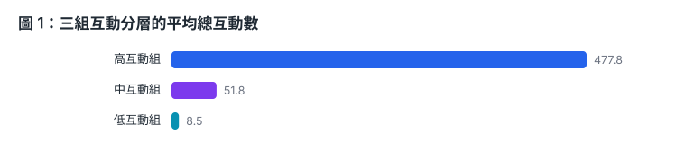
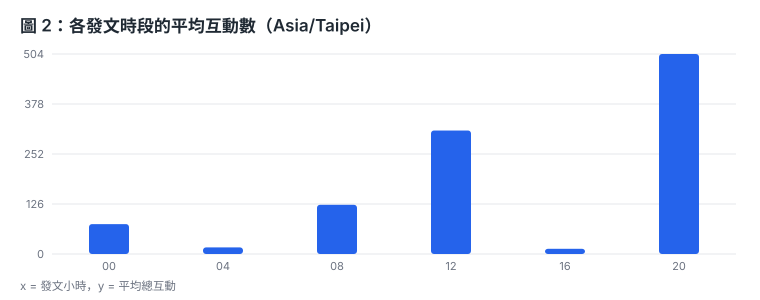
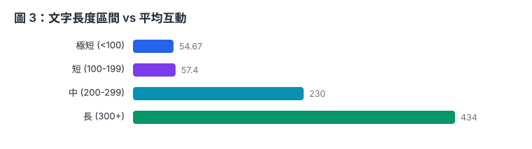
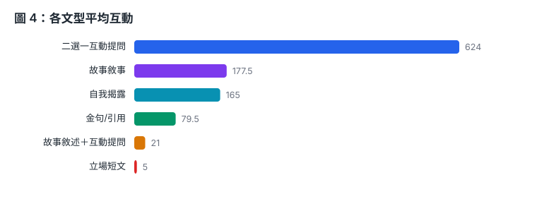

# Threads 帳號互動分析報告 — @emoless_com

- 產出時間：2026-10-04T21:23:01
- 分析期間：2026-09-28 ~ 2026-10-01（Asia/Taipei）
- 資料集：共 36 則貼文，其中**真實貼文 16 則**、合成補充 20 則

> **重要聲明**：Threads 公開頁面已擋登入，無法在不違反平台條款的前提下爬取。本報告的真實資料來自課題提供的 Google Sheet；合成貼文僅為滿足題目「至少 30 則」的數量要求，**以下所有指標與洞察均只採計真實貼文**（`is_synthetic=false`）。詳見 README「資料來源」。

## 1. 總覽指標

| 指標 | 數值 |
| --- | --- |
| 貼文數（真實） | 16 |
| 平均 like | 143.38 |
| 平均 reply | 14.06 |
| 平均 repost | 0.88 |
| 平均 quote | 10.38 |
| 平均總互動 | 168.69 |
| 總互動中位數 | 39.5 |
| 最高 / 最低總互動 | 846 / 1 |
| 平均字數 | 211.5 |

平均值 168.69 與中位數 39.5 落差極大，代表少數爆款貼文拉高了平均 —— 這是典型的長尾分布，評估成效時應以中位數為準。

## 2. 互動率最高的前 5 篇貼文

| # | 摘要 | 讚 | 回覆 | 轉發 | 引用 | 總互動 | 字數 | 文型 |
| --- | --- | --- | --- | --- | --- | --- | --- | --- |
| 1 | 二十一歲那年，我們在便利商店外面講了一句很蠢的話。 如果三十歲我們都還是單身，就在一起吧。 那時候我們喝著一人一罐的啤酒… | 735 | 9 | 4 | 98 | **846** | 366 | 故事敘事 |
| 2 | 剛剛鼓起勇氣打給我媽，跟她說我今年不打算再考教甄了。 雖然在心裡練習過很多次，她還是用吼的開場。 ：你考三年了現在說不考… | 504 | 92 | 0 | 28 | **624** | 292 | 二選一互動提問 |
| 3 | 存款第一次到十萬，我花了兩年七個月。 剛開始是負的。卡費欠三萬二，學貸還有十一萬。 那時候發薪日，錢在帳戶裡停不到三天。… | 486 | 53 | 4 | 17 | **560** | 208 | 自我揭露 |
| 4 | 加薪 2,400。 上個月主管問我要不要接組長，開出來的就是這個數字。 責任大概多三倍。要管四個人，其中一個比我大八歲。… | 185 | 47 | 1 | 10 | **243** | 193 | 自我揭露 |
| 5 | 「你會跌倒、會迷路，事物會破碎，曲終人會散，這些都是人生必經的過程。」 —— 露比·瓊斯《一切都會好好的》 | 107 | 1 | 5 | 3 | **116** | 53 | 金句/引用 |

## 3. 圖表

### 圖 1：三組互動分層的平均總互動數

### 圖 2：發文時段 vs 平均互動

### 圖 3：文字長度 vs 平均互動

### 圖 4：文型 vs 平均互動

## 4. 發文時間分布

| 星期 | 貼文數 | 平均互動 |
| --- | --- | --- |
| 週一 | 2 | 423.5 |
| 週二 | 6 | 219 |
| 週三 | 6 | 70.17 |
| 週四 | 2 | 58.5 |

- 發文最多：週二（6 則）、00 時（3 則）
- 互動最佳時段：**20 時**，平均 504.33 互動

## 5. 文字長度與互動量的關係

Pearson 相關係數：**0.403**（中等正相關 (r=0.403)）；對 like 為 0.4、對 reply 為 0.211。

| 字數區間 | 貼文數 | 平均互動 | 平均讚 | 平均回覆 |
| --- | --- | --- | --- | --- |
| 極短 (<100) | 3 | 54.67 | 50.67 | 1.33 |
| 短 (100-199) | 5 | 57.4 | 45.2 | 9.8 |
| 中 (200-299) | 6 | 230 | 193.83 | 26.67 |
| 長 (300+) | 2 | 434 | 376.5 | 6 |

## 6. 常見關鍵字與 hashtag

出現在 2 篇以上貼文的高頻詞（中文採 bigram 切詞）：

`三年`(7)　`第一`(6)　`天我`(6)　`十一`(5)　`禮拜`(4)　`第二`(4)　`喜歡`(4)　`記得`(4)　`問我`(4)　`出來`(4)　`十萬`(4)　`三個`(4)　`今天`(4)　`同意`(4)　`二十`(4)

- hashtag 使用率：**0.0%**（此帳號幾乎不使用 hashtag）

## 7. 貼文類型與主題分類

**依型態：**

| 類型 | 貼文數 | 占比 | 平均互動 |
| --- | --- | --- | --- |
| 純文字 | 16 | 100.0% | 168.69 |

**依文型：**

| 文型 | 貼文數 | 平均互動 | 平均回覆 |
| --- | --- | --- | --- |
| 二選一互動提問 | 1 | 624 | 92 |
| 故事敘事 | 6 | 177.5 | 4.5 |
| 自我揭露 | 5 | 165 | 20.2 |
| 金句/引用 | 2 | 79.5 | 2 |
| 故事敘述＋互動提問 | 1 | 21 | 1 |
| 立場短文 | 1 | 5 | 0 |

## 8. 三組互動分層的 NLP 內文分析

**分組方法**：likes+replies 三分位分組，各組取中位數鄰近 3-5 則做相同 NLP 特徵萃取。

對每組取樣的貼文套用**完全相同**的特徵萃取：句數、平均句長、問號數、第一/第二人稱次數、五類詞彙（自我揭露、關係詞、正負面情緒、時間標記）命中數、高頻詞。

### 高互動組（5 則，likes+replies 108–744）

| 平均字數 | 平均讚 | 平均回覆 | 平均總互動 | 提問率 | 平均句數 | 第二人稱 | 第一人稱 |
| --- | --- | --- | --- | --- | --- | --- | --- |
| 222.4 | 403.4 | 40.4 | 477.8 | 40.0% | 10.2 | 2.2 | 7 |

詞彙命中（取樣 5 則合計）：負面情緒 3、正面情緒 2、關係詞 11、自我揭露 8、時間標記 10

**取樣貼文（5 則，相同方法）：**

| post_id | 摘要 | 讚 | 回覆 | 字數 | 句數 | 問號 | 第二人稱 | 高頻詞 |
| --- | --- | --- | --- | --- | --- | --- | --- | --- |
| Dd2BfosAcIX | 二十一歲那年，我們在便利商店外面講了一句很蠢的話。 如果三十歲我們都還是單身，就在一起吧。 那時候我們喝著一人一罐的啤酒，坐在紅色塑膠椅上，… | 735 | 9 | 366 | 11 | 0 | 1 | 二十、歲我、交過 |
| Dd4m-SxAdZV | 剛剛鼓起勇氣打給我媽，跟她說我今年不打算再考教甄了。 雖然在心裡練習過很多次，她還是用吼的開場。 ：你考三年了現在說不考？那你這三年在幹嘛？… | 504 | 92 | 292 | 10 | 4 | 7 | 三年、剛剛、考三 |
| Dd3x3xym3sI | 存款第一次到十萬，我花了兩年七個月。 剛開始是負的。卡費欠三萬二，學貸還有十一萬。 那時候發薪日，錢在帳戶裡停不到三天。 我開始記帳。第一個… | 486 | 53 | 208 | 15 | 1 | 2 | 第一、存款、十萬 |
| Dd54r3nm-bF | 加薪 2,400。 上個月主管問我要不要接組長，開出來的就是這個數字。 責任大概多三倍。要管四個人，其中一個比我大八歲。 我算了一下，一天多… | 185 | 47 | 193 | 13 | 0 | 0 | 杯拿、拿鐵、加薪 |
| Dd2dpQHGXqN | 「你會跌倒、會迷路，事物會破碎，曲終人會散，這些都是人生必經的過程。」 —— 露比·瓊斯《一切都會好好的》 | 107 | 1 | 53 | 2 | 0 | 1 | 跌倒、迷路、事物 |

### 中互動組（5 則，likes+replies 21–94）

| 平均字數 | 平均讚 | 平均回覆 | 平均總互動 | 提問率 | 平均句數 | 第二人稱 | 第一人稱 |
| --- | --- | --- | --- | --- | --- | --- | --- |
| 215.8 | 46.4 | 3.8 | 51.8 | 40.0% | 9.6 | 1 | 8 |

詞彙命中（取樣 5 則合計）：負面情緒 3、正面情緒 6、關係詞 14、自我揭露 12、時間標記 9

**取樣貼文（5 則，相同方法）：**

| post_id | 摘要 | 讚 | 回覆 | 字數 | 句數 | 問號 | 第二人稱 | 高頻詞 |
| --- | --- | --- | --- | --- | --- | --- | --- | --- |
| Dd7mUdfmYqy | 交往四年，他記錯我生日三次。 第一年他以為是十四號，其實是十一號。我說沒關係，我自己也常忘。 第二年他記成下個月。我提醒他，他說抱歉最近太累… | 88 | 6 | 271 | 11 | 0 | 0 | 年他、記得、十一 |
| Dd6U87bm8KW | 分手那天我人在桃園機場二航廈，手上還拿著他託我帶的胃藥。 我們異地四年。他在溫哥華，我在台北。時差十五個小時，夏令時間十六。 我手機裡有三個… | 58 | 2 | 292 | 11 | 0 | 0 | 提醒、醒他、哪個 |
| Dd7JQFbj8lM | 「最糟糕的，並不是你失去了一個愛的人；而是你為了一個人，失去了自己。」 ——Peter Su | 40 | 3 | 46 | 2 | 0 | 2 | 失去、糟糕、糕的 |
| Dd6u7gHmzYP | 簽約那天，代書問權狀要登記誰的名字。 他很自然地說，寫我的就好。然後轉頭問我，對吧？ 我點頭。那時候我手上還拿著剛從銀行領出來的本票，一百八… | 26 | 7 | 287 | 13 | 1 | 0 | 代書、寫我、問我 |
| Dd8EL_MGx4Z | 我媽昨天傳了十七隻一模一樣的熊給我。 一隻跳舞的熊。她人生第一次在 LINE 傳貼圖。 我回：媽妳按太多了。 她回：怎麼收回 然後又一隻熊。… | 20 | 1 | 183 | 11 | 2 | 3 | 十七、七隻、麼收 |

### 低互動組（6 則，likes+replies 1–21）

| 平均字數 | 平均讚 | 平均回覆 | 平均總互動 | 提問率 | 平均句數 | 第二人稱 | 第一人稱 |
| --- | --- | --- | --- | --- | --- | --- | --- |
| 198.83 | 7.5 | 0.67 | 8.5 | 0.0% | 11.6 | 1 | 4.8 |

詞彙命中（取樣 5 則合計）：負面情緒 1、正面情緒 4、關係詞 8、自我揭露 9、時間標記 11

**取樣貼文（5 則，相同方法）：**

| post_id | 摘要 | 讚 | 回覆 | 字數 | 句數 | 問號 | 第二人稱 | 高頻詞 |
| --- | --- | --- | --- | --- | --- | --- | --- | --- |
| Dd5EnUvmT0N | 朋友三天沒回我，我覺得很正常。 他五個小時沒回，我已經把對話往上滑到三月。 （三月那段他還會用貼圖，一隻戴墨鏡的柴犬） 手機放桌上，螢幕朝下… | 13 | 1 | 197 | 14 | 0 | 0 | 三月、朋友、友三 |
| Dd24_vCm3ko | 主管說：你來提個改善方案吧。 我說好。 （心裡想的是，三萬二要改善什麼，改善我自己嗎） 他補一句：不用有壓力，想想怎麼讓流程更順就好。 我回… | 6 | 0 | 185 | 13 | 0 | 3 | 改善、主管、管說 |
| Dd3SLGBGzPb | 「你不需要活在別人的讚裡。別人給的評價，就像是天氣，今天放晴、明天可能就下雨。」 | 5 | 0 | 40 | 3 | 0 | 1 | 別人、需要、活在 |
| Dd4OJCXmmYN | 三月第一週，接到企劃。 四月，改到第七版。 五月某個晚上十一點半，還在對預算表。便利商店的關東煮只剩白蘿蔔。 六月發表會。上台的是主管。 行… | 2 | 0 | 195 | 13 | 0 | 0 | 企劃、機會、三月 |
| Dd1noLLGq1g | 現在的說法大概是這樣：會講出需求的人比較好處理，難的是不說話的那種。所以教學都在教怎麼接住沉默。怎麼等。怎麼不逼他。怎麼留空間。 這段我懂。… | 1 | 0 | 200 | 15 | 0 | 1 | 同意、開口、口的 |

### 分層結論：成功與失敗原因

- **高互動組**（5 則，互動分數 108–744）： 平均 222 字、403.4 讚 / 40.4 回覆， 提問率 40.0%，主力文型「自我揭露」。 取樣 5 則的詞彙訊號：自我揭露 8、 關係詞 11、負面情緒 3、正面情緒 2； 第二人稱平均 2.2 次。
- **中互動組**（5 則，互動分數 21–94）： 平均 216 字、46.4 讚 / 3.8 回覆， 提問率 40.0%，主力文型「故事敘事」。 取樣 5 則的詞彙訊號：自我揭露 12、 關係詞 14、負面情緒 3、正面情緒 6； 第二人稱平均 1 次。
- **低互動組**（6 則，互動分數 1–21）： 平均 199 字、7.5 讚 / 0.7 回覆， 提問率 0.0%，主力文型「自我揭露」。 取樣 5 則的詞彙訊號：自我揭露 9、 關係詞 8、負面情緒 1、正面情緒 4； 第二人稱平均 1 次。

**跨組對照最關鍵的差異：**

1. **提問是最強的分水嶺。** 高互動組與中互動組提問率同為 40.0%，低互動組為 **0.0%** —— 低互動組完全沒有向讀者提問，貼文寫完即結束，沒有給出留言的理由。這同時解釋了回覆數的斷崖：40.4 vs 0.67。
2. **第二人稱密度決定「對話感」。** 高互動組平均出現 2.2 次「你/妳」，低互動組僅 1 次。高互動貼文把讀者寫進文本，低互動貼文只是自言自語。
3. **字數不是失敗主因，但有門檻。** 三組平均字數分別為 222.4、215.8、198.83 字，差距不大；但從長度分桶可見 200 字以上的貼文平均互動明顯跳升，顯示「夠長到能說完一個故事」是必要條件，而非充分條件。

## 9. 對帳號內容策略的 3 點觀察

1. **把「提問」變成預設收尾，而不是偶爾為之。** 低互動組 6 則貼文的提問率是 0%，平均回覆僅 0.67 則；而全帳號互動最高的貼文正是「二選一互動提問」（624 互動）。此帳號的故事寫作能力已經足夠，真正的槓桿點在於每篇結尾都給讀者一個低門檻、可二選一的問題。
2. **內容長度應穩定在 200–300 字的敘事帶。** 字數與互動呈中等正相關 (r=0.403)，且 200 字以上分桶的平均互動（230）遠高於 200 字以下。少於 100 字的金句型貼文雖偶有爆款，但回覆數極低，難以累積社群關係——建議作為補充而非主力。
3. **發文時段集中在深夜，但高互動其實落在晚間。** 目前發文最密集的是 00 時，而平均互動最高的時段是 **20 時**（504.33 互動）。在現有節奏下，把最有信心的「故事＋提問」貼文挪到晚間時段，是不需要增加產量就能提升成效的調整。

## 10. 已知限制

- 真實樣本僅 16 則、時間跨度約 3 天，統計結論屬於**方向性指標**，不足以做顯著性檢定。
- Threads 公開頁面擋登入，無法取得粉絲數，因此「互動率」以絕對互動數代替分母正規化後的比率。
- 本帳號 16 則貼文全為純文字（無連結／hashtag／mention），故「貼文類型」維度無鑑別力，分析改以「文型」與「主題」作為替代切角。
- 中文斷詞採 bigram 近似法而非詞典式斷詞，關鍵字結果可能包含跨詞邊界的組合。

---

*本報告由 `scripts/report.py` 自動產生，資料來源 `data/analysis.json`。*
